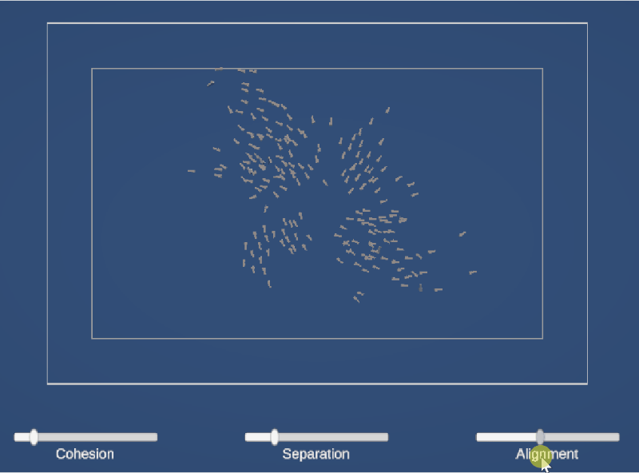

# Unity Boids Research Project

  

An implementation of the **Boids flocking algorithm** in Unity, developed as a personal research project to explore emergent behaviors and crowd AI for video games.

---

## Overview

This project simulates the movement of a flock (birds, fish, or crowds) based on three simple local rules. The core goal was to bridge the gap between **mathematical simulation** and **game-ready AI architecture**.

The implementation is a hybrid approach combining:
- **Hunter Adams' Logic:** For precise mathematical accumulation of velocity.
- **Craig Reynolds' Steering Behaviors:** For smooth, force-based transitions and organic movement.

## Key Features

- **The Three Pillars of Flocking:** Fully implemented Separation, Alignment, and Cohesion.
- **Dynamic UI Control:** Real-time adjustment of AI weights and ranges via a custom Canvas interface.
- **ScriptableObject-Driven Design:** All AI parameters are decoupled from the code, allowing for instant "behavior profiles" (e.g., erratic insects vs. synchronized fish).
- **Soft Boundary System:** A two-tier edge detection system (`Pre-Radius` and `Edge-Radius`) to ensure smooth directional changes when agents approach simulation limits.
- **2D/3D Hybrid:** Simulated on a vertical X/Y plane within a 3D URP environment for optimal visual fidelity and future 3D expansion.

## Technical Architecture

The project follows the **SOLID principles** to ensure scalability and performance:

- **`BoidManager`**: Orchestrates the simulation, handles spawning, and maintains the global agent registry.
- **`BoidAgent`**: The physical entity. It handles its own perception (neighbor detection) and applies the movement.
- **`BoidLogic`**: A static, pure-mathematics class that calculates steering vectors independently of the Unity engine.
- **`BoidSettings` (ScriptableObject)**: Centralized data container for easy balancing and memory efficiency.

## Research Goals

As a Game Programming student, this project allowed me to experiment with:
1. **Optimization:** Moving from $O(n^2)$ complexity towards scalable neighbor detection.
2. **Vector Math:** Mastering 3D vector arithmetic and Quaternions for organic rotations.
3. **UI/UX Integration:** Linking real-time user input to internal AI heuristics.

## How to Run

1. Clone this repository.
2. Open the project in **Unity 6** (or later).
3. Load the `SampleScene` located in `Assets/_Project/Scenes/`.
4. Press **Play** and use the on-screen sliders to manipulate the flock's behavior in real-time.

---

## References
- *Craig Reynolds (1987) - Flocks, Herds, and Schools: A Distributed Behavioral Model.*
- *Hunter Adams (Cornell University) - Boids Algorithm on Microcontrollers.*

---

**Developed by Baptiste Monin**
